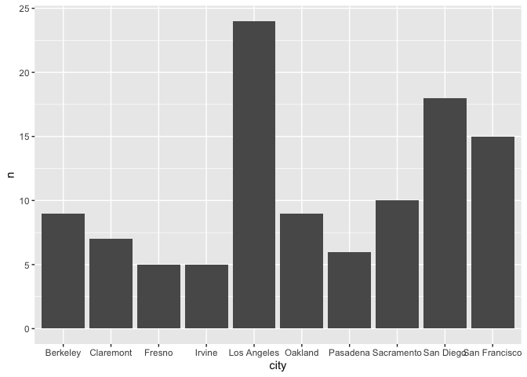
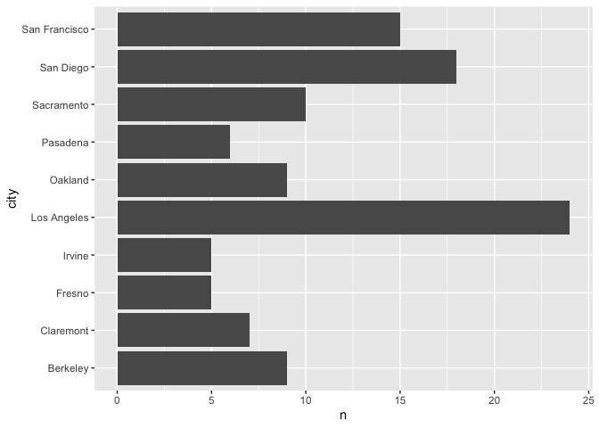
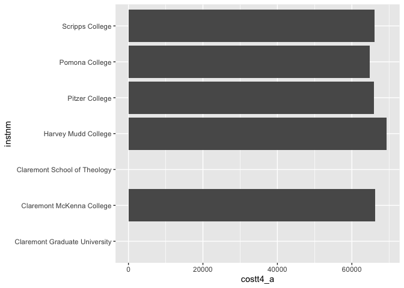

## Instructions
Answer the following questions and complete the exercises in RMarkdown. Please embed all of your code and push your final work to your repository. Your final lab report should be organized, clean, and run free from errors. Remember, you must remove the `#` for the included code chunks to run. Be sure to add your name to the author header above.  

Make sure to use the formatting conventions of RMarkdown to make your report neat and clean!  

## Load the libraries

```r
library(tidyverse)
library(janitor)
library(here)
library(naniar)
```

For this homework, we will take a departure from biological data and use data about California colleges. These data are a subset of the national college scorecard (https://collegescorecard.ed.gov/data/). Load the `ca_college_data.csv` as a new object called `colleges`.

```r
colleges <- read_csv("data/ca_college_data.csv") %>% clean_names
```

```
## Rows: 341 Columns: 10
## ── Column specification ────────────────────────────────────────────────────────
## Delimiter: ","
## chr (4): INSTNM, CITY, STABBR, ZIP
## dbl (6): ADM_RATE, SAT_AVG, PCIP26, COSTT4_A, C150_4_POOLED, PFTFTUG1_EF
## 
## ℹ Use `spec()` to retrieve the full column specification for this data.
## ℹ Specify the column types or set `show_col_types = FALSE` to quiet this message.
```

The variables are a bit hard to decipher, here is a key:  

INSTNM: Institution name  
CITY: California city  
STABBR: Location state  
ZIP: Zip code  
ADM_RATE: Admission rate  
SAT_AVG: SAT average score  
PCIP26: Percentage of degrees awarded in Biological And Biomedical Sciences  
COSTT4_A: Annual cost of attendance  
C150_4_POOLED: 4-year completion rate  
PFTFTUG1_EF: Percentage of undergraduate students who are first-time, full-time degree/certificate-seeking undergraduate students  

1. Use your preferred function(s) to have a look at the data and get an idea of its structure. Make sure you summarize NA's and determine whether or not the data are tidy. You may also consider dealing with any naming issues.

```r
glimpse(colleges)
```

```
## Rows: 341
## Columns: 10
## $ instnm        <chr> "Grossmont College", "College of the Sequoias", "College…
## $ city          <chr> "El Cajon", "Visalia", "San Mateo", "Ventura", "Oxnard",…
## $ stabbr        <chr> "CA", "CA", "CA", "CA", "CA", "CA", "CA", "CA", "CA", "C…
## $ zip           <chr> "92020-1799", "93277-2214", "94402-3784", "93003-3872", …
## $ adm_rate      <dbl> NA, NA, NA, NA, NA, NA, NA, NA, NA, NA, NA, NA, NA, NA, …
## $ sat_avg       <dbl> NA, NA, NA, NA, NA, NA, NA, NA, NA, NA, NA, NA, NA, NA, …
## $ pcip26        <dbl> 0.0016, 0.0066, 0.0038, 0.0035, 0.0085, 0.0151, 0.0000, …
## $ costt4_a      <dbl> 7956, 8109, 8278, 8407, 8516, 8577, 8580, 9181, 9281, 93…
## $ c150_4_pooled <dbl> NA, NA, NA, NA, NA, NA, 0.2334, NA, NA, NA, NA, 0.1704, …
## $ pftftug1_ef   <dbl> 0.3546, 0.5413, 0.3567, 0.3824, 0.2753, 0.4286, 0.2307, …
```

```r
head(colleges)
```

```
## # A tibble: 6 × 10
##   instnm       city  stabbr zip   adm_rate sat_avg pcip26 costt4_a c150_4_pooled
##   <chr>        <chr> <chr>  <chr>    <dbl>   <dbl>  <dbl>    <dbl>         <dbl>
## 1 Grossmont C… El C… CA     9202…       NA      NA 0.0016     7956            NA
## 2 College of … Visa… CA     9327…       NA      NA 0.0066     8109            NA
## 3 College of … San … CA     9440…       NA      NA 0.0038     8278            NA
## 4 Ventura Col… Vent… CA     9300…       NA      NA 0.0035     8407            NA
## 5 Oxnard Coll… Oxna… CA     9303…       NA      NA 0.0085     8516            NA
## 6 Moorpark Co… Moor… CA     9302…       NA      NA 0.0151     8577            NA
## # ℹ 1 more variable: pftftug1_ef <dbl>
```

```r
anyNA(colleges)
```

```
## [1] TRUE
```

```r
naniar::miss_var_summary(colleges)
```

```
## # A tibble: 10 × 3
##    variable      n_miss pct_miss
##    <chr>          <int>    <dbl>
##  1 sat_avg          276     80.9
##  2 adm_rate         240     70.4
##  3 c150_4_pooled    221     64.8
##  4 costt4_a         124     36.4
##  5 pftftug1_ef       53     15.5
##  6 pcip26            35     10.3
##  7 instnm             0      0  
##  8 city               0      0  
##  9 stabbr             0      0  
## 10 zip                0      0
```

2. Which cities in California have the highest number of colleges?

```r
college_city <- colleges %>%
  count(city, sort = T) %>%
  head(10)
college_city
```

```
## # A tibble: 10 × 2
##    city              n
##    <chr>         <int>
##  1 Los Angeles      24
##  2 San Diego        18
##  3 San Francisco    15
##  4 Sacramento       10
##  5 Berkeley          9
##  6 Oakland           9
##  7 Claremont         7
##  8 Pasadena          6
##  9 Fresno            5
## 10 Irvine            5
```
Los Angeles has the most colleges with San Diego and San Francisco behind. 

3. Based on your answer to #2, make a plot that shows the number of colleges in the top 10 cities.

```r
college_city %>%
  ggplot(aes(x = city, y = n)) +
  geom_col() # the x axis on this plot is kind of clustered
```

<!-- -->

```r
college_city %>%
  ggplot(aes(x = city, y = n)) +
  geom_col() +
  coord_flip() # now the cities are not clustered
```

<!-- -->

4. The column `COSTT4_A` is the annual cost of each institution. Which city has the highest average cost? Where is it located?

```r
college_cost <- colleges %>%
  group_by(city) %>%
  select(costt4_a, city) %>%
  summarize(average_city_cost = mean(costt4_a, na.rm=T),
            n_distinct_city = n_distinct(city))

college_cost %>%
  arrange(desc(average_city_cost))
```

```
## # A tibble: 161 × 3
##    city                average_city_cost n_distinct_city
##    <chr>                           <dbl>           <int>
##  1 Claremont                       66498               1
##  2 Malibu                          66152               1
##  3 Valencia                        64686               1
##  4 Orange                          64501               1
##  5 Redlands                        61542               1
##  6 Moraga                          61095               1
##  7 Atherton                        56035               1
##  8 Thousand Oaks                   54373               1
##  9 Rancho Palos Verdes             50758               1
## 10 La Verne                        50603               1
## # ℹ 151 more rows
```
Claremont has the highest average city cost. It is located near LA.

5. Based on your answer to #4, make a plot that compares the cost of the individual colleges in the most expensive city. Bonus! Add UC Davis here to see how it compares :>).

```r
claremont <- colleges %>%
  filter(city=="Claremont") %>%
  select(instnm, costt4_a)
```


```r
colleges %>%
  select(instnm, costt4_a, city) %>%
  filter(city == "Claremont") %>% # compare individual colleges in the most expensive city
  ggplot(aes(x=instnm, y=costt4_a))+
  geom_col()+
  coord_flip()
```

```
## Warning: Removed 2 rows containing missing values (`position_stack()`).
```

<!-- -->

```r
colleges %>%
  select(instnm, costt4_a, city) %>%
  filter(city == "Davis" | city == "Claremont") %>% # add Davis to compare
  ggplot(aes(x=instnm, y=costt4_a))+
  geom_col()+
  coord_flip()
```

```
## Warning: Removed 2 rows containing missing values (`position_stack()`).
```

<!-- -->

6. The column `ADM_RATE` is the admissions rate by college and `C150_4_POOLED` is the four-year completion rate. Use a scatterplot to show the relationship between these two variables. What do you think this means?

```r
ggplot(data=colleges, #specify the data
       mapping=aes(x=adm_rate, y=c150_4_pooled))+ #map the aesthetics
  geom_point()+ #add the plot type
  geom_smooth(method=lm, se=T) #add a regression line
```

```
## `geom_smooth()` using formula = 'y ~ x'
```

```
## Warning: Removed 251 rows containing non-finite values (`stat_smooth()`).
```

```
## Warning: Removed 251 rows containing missing values (`geom_point()`).
```

<!-- -->
As admission rate increases, the four-year completion rate decreases. This could mean it likely accepts students deemed "risks" by colleges with higher completion rates, such as inconsistent academic rates.  

7. Is there a relationship between cost and four-year completion rate? (You don't need to do the stats, just produce a plot). What do you think this means?

```r
colleges %>%
  ggplot(aes(x=costt4_a, y=c150_4_pooled)) +
  geom_point() +
  geom_smooth(method=lm, se=T)
```

```
## `geom_smooth()` using formula = 'y ~ x'
```

```
## Warning: Removed 225 rows containing non-finite values (`stat_smooth()`).
```

```
## Warning: Removed 225 rows containing missing values (`geom_point()`).
```

<!-- -->
As cost increases, the four-year completion rate increases. Students paying more for tuition may feel more inclined to finish a degree considering how much money they have already put towards it.  

8. The column titled `INSTNM` is the institution name. We are only interested in the University of California colleges. Make a new data frame that is restricted to UC institutions. You can remove `Hastings College of Law` and `UC San Francisco` as we are only interested in undergraduate institutions.

```r
univ_ca <- colleges %>% 
  filter_all(any_vars(str_detect(., pattern = "University of California")))
```

Remove `Hastings College of Law` and `UC San Francisco` and store the final data frame as a new object `univ_calif_final`.

```r
univ_calif_final <- univ_ca %>%
  filter(city!="San Francisco")
```

Use `separate()` to separate institution name into two new columns "UNIV" and "CAMPUS".

```r
univ_calif_final <- univ_calif_final %>%
  separate(instnm, into = c("univ", "campus"), sep = "-")
univ_calif_final
```

```
## # A tibble: 8 × 11
##   univ  campus city  stabbr zip   adm_rate sat_avg pcip26 costt4_a c150_4_pooled
##   <chr> <chr>  <chr> <chr>  <chr>    <dbl>   <dbl>  <dbl>    <dbl>         <dbl>
## 1 Univ… San D… La J… CA     92093    0.357    1324  0.216    31043         0.872
## 2 Univ… Irvine Irvi… CA     92697    0.406    1206  0.107    31198         0.876
## 3 Univ… River… Rive… CA     92521    0.663    1078  0.149    31494         0.73 
## 4 Univ… Los A… Los … CA     9009…    0.180    1334  0.155    33078         0.911
## 5 Univ… Davis  Davis CA     9561…    0.423    1218  0.198    33904         0.850
## 6 Univ… Santa… Sant… CA     9506…    0.578    1201  0.193    34608         0.776
## 7 Univ… Berke… Berk… CA     94720    0.169    1422  0.105    34924         0.916
## 8 Univ… Santa… Sant… CA     93106    0.358    1281  0.108    34998         0.816
## # ℹ 1 more variable: pftftug1_ef <dbl>
```
9. The column `ADM_RATE` is the admissions rate by campus. Which UC has the lowest and highest admissions rates? Produce a numerical summary and an appropriate plot.

```r
univ_calif_final %>%
  select(univ, campus, city, adm_rate) %>%
  group_by(adm_rate) %>%
  arrange(desc(adm_rate))
```

```
## # A tibble: 8 × 4
## # Groups:   adm_rate [8]
##   univ                     campus        city          adm_rate
##   <chr>                    <chr>         <chr>            <dbl>
## 1 University of California Riverside     Riverside        0.663
## 2 University of California Santa Cruz    Santa Cruz       0.578
## 3 University of California Davis         Davis            0.423
## 4 University of California Irvine        Irvine           0.406
## 5 University of California Santa Barbara Santa Barbara    0.358
## 6 University of California San Diego     La Jolla         0.357
## 7 University of California Los Angeles   Los Angeles      0.180
## 8 University of California Berkeley      Berkeley         0.169
```

```r
univ_calif_final %>%
  ggplot(aes(x=campus, y=adm_rate))+
  geom_col()+
  coord_flip()
```

<!-- -->
Riverside has the highest admissions rate while Berkeley has the lowest.  

10. If you wanted to get a degree in biological or biomedical sciences, which campus confers the majority of these degrees? Produce a numerical summary and an appropriate plot.

```r
univ_calif_final %>%
  select(campus, pcip26) %>% # pcip26 = degrees in bio/biomed sciences
  arrange(desc(pcip26))
```

```
## # A tibble: 8 × 2
##   campus        pcip26
##   <chr>          <dbl>
## 1 San Diego      0.216
## 2 Davis          0.198
## 3 Santa Cruz     0.193
## 4 Los Angeles    0.155
## 5 Riverside      0.149
## 6 Santa Barbara  0.108
## 7 Irvine         0.107
## 8 Berkeley       0.105
```


```r
univ_calif_final %>%
  ggplot(aes(x=campus, y=pcip26))+
  geom_col()+
  coord_flip()
```

<!-- -->
San Diego confers the majority of these degrees. 
## Knit Your Output and Post to [GitHub](https://github.com/FRS417-DataScienceBiologists)
