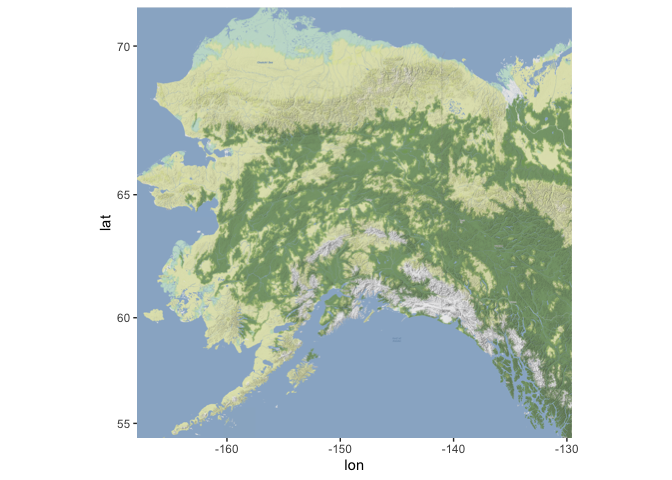
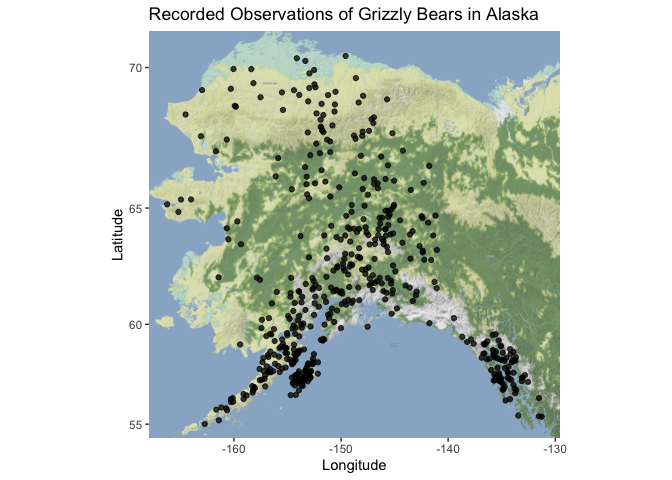
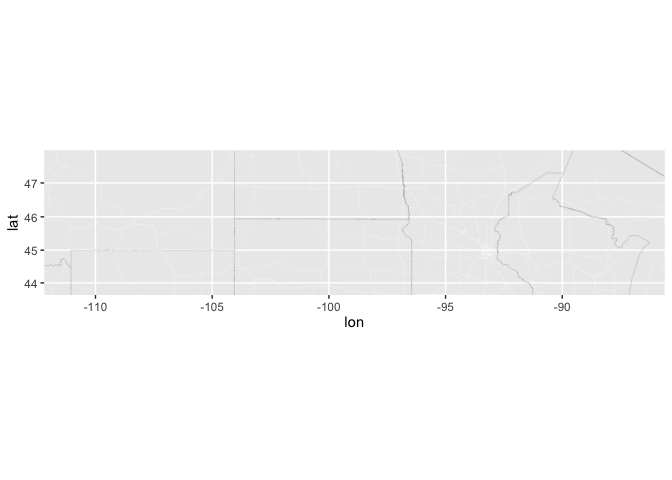
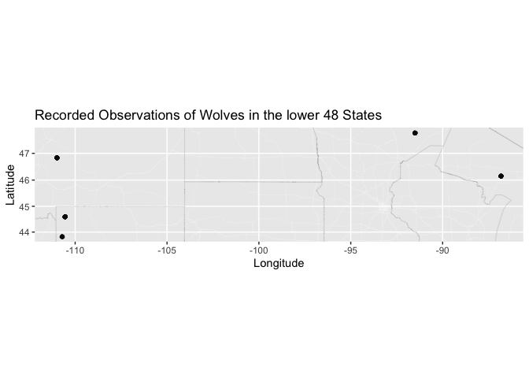
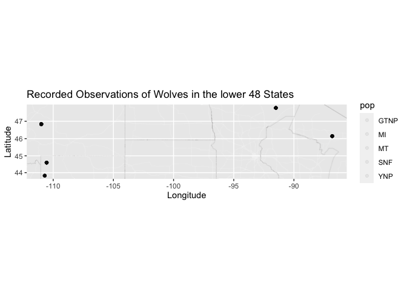
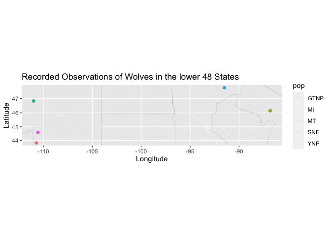

## Instructions
Answer the following questions and complete the exercises in RMarkdown. Please embed all of your code and push your final work to your repository. Your final lab report should be organized, clean, and run free from errors. Remember, you must remove the `#` for the included code chunks to run. Be sure to add your name to the author header above. For any included plots, make sure they are clearly labeled. You are free to use any plot type that you feel best communicates the results of your analysis.  

Make sure to use the formatting conventions of RMarkdown to make your report neat and clean!  

## Load the libraries  

```r
library(tidyverse)
library(janitor)
library(ggmap)
library(here)
```

## Load the Data
We will use two separate data sets for this homework.  

1. The first [data set](https://rcweb.dartmouth.edu/~f002d69/workshops/index_rspatial.html) represent sightings of grizzly bears (Ursos arctos) in Alaska.  

```r
grizzly <- read.csv("data/bear-sightings.csv")
```

2. The second data set is from Brandell, Ellen E (2021), Serological dataset and R code for: Patterns and processes of pathogen exposure in gray wolves across North America, Dryad, [Dataset](https://doi.org/10.5061/dryad.5hqbzkh51).  

```r
wolves <- read.csv("data/wolves_data/wolves_dataset.csv")
```

# load api key

```r
#register_stadiamaps("fill api key", write = FALSE)
```

1. Load the `grizzly` data and evaluate its structure.  

```r
summary(grizzly)
```

```
##     bear.id       longitude         latitude    
##  Min.   :   7   Min.   :-166.2   Min.   :55.02  
##  1st Qu.:2569   1st Qu.:-154.2   1st Qu.:58.13  
##  Median :4822   Median :-151.0   Median :60.97  
##  Mean   :4935   Mean   :-149.1   Mean   :61.41  
##  3rd Qu.:7387   3rd Qu.:-145.6   3rd Qu.:64.13  
##  Max.   :9996   Max.   :-131.3   Max.   :70.37
```

2. Use the range of the latitude and longitude to build an appropriate bounding box for your map. 

```r
grizzly %>%
  select(longitude, latitude) %>%
  summary()
```

```
##    longitude         latitude    
##  Min.   :-166.2   Min.   :55.02  
##  1st Qu.:-154.2   1st Qu.:58.13  
##  Median :-151.0   Median :60.97  
##  Mean   :-149.1   Mean   :61.41  
##  3rd Qu.:-145.6   3rd Qu.:64.13  
##  Max.   :-131.3   Max.   :70.37
```

```r
latitude <- c(55.02, 70.37)
longitude <- c(-166.2, -131.3)
grizzly_bbox <- make_bbox(longitude, latitude, f=0.05)
```

3. Load a map from `stamen` in a terrain style projection and display the map.  

```r
map1 <- get_stadiamap(grizzly_bbox, maptype="stamen_terrain", zoom=7)
```

```
## ℹ © Stadia Maps © Stamen Design © OpenMapTiles © OpenStreetMap contributors.
```

```
## ℹ 196 tiles needed, this may take a while (try a smaller zoom?)
```

```r
ggmap(map1)
```

<!-- -->

4. Build a final map that overlays the recorded observations of grizzly bears in Alaska.  

```r
ggmap(map1)+
  geom_point(data=grizzly, aes(longitude, latitude), alpha=0.75)+
  labs(title="Recorded Observations of Grizzly Bears in Alaska",
       x="Longitude",
       y="Latitude")
```

<!-- -->

Let's switch to the wolves data. Brandell, Ellen E (2021), Serological dataset and R code for: Patterns and processes of pathogen exposure in gray wolves across North America, Dryad, [Dataset](https://doi.org/10.5061/dryad.5hqbzkh51).  

5. Load the data and evaluate its structure.  # loaded above

```r
summary(wolves)
```

```
##      pop                 year        age.cat              sex           
##  Length:1986        Min.   :1992   Length:1986        Length:1986       
##  Class :character   1st Qu.:2006   Class :character   Class :character  
##  Mode  :character   Median :2011   Mode  :character   Mode  :character  
##                     Mean   :2010                                        
##                     3rd Qu.:2016                                        
##                     Max.   :2019                                        
##                                                                         
##     color                lat             long            habitat       
##  Length:1986        Min.   :33.89   Min.   :-157.84   Min.   :  254.1  
##  Class :character   1st Qu.:44.60   1st Qu.:-123.73   1st Qu.:10375.2  
##  Mode  :character   Median :46.83   Median :-110.99   Median :11211.3  
##                     Mean   :50.43   Mean   :-116.86   Mean   :12797.4  
##                     3rd Qu.:57.89   3rd Qu.:-110.55   3rd Qu.:11860.8  
##                     Max.   :80.50   Max.   : -82.42   Max.   :34676.6  
##                                                                        
##      human          pop.density      pack.size    standard.habitat  
##  Min.   :   0.02   Min.   : 3.74   Min.   :3.55   Min.   :-1.63390  
##  1st Qu.:  80.60   1st Qu.: 7.40   1st Qu.:5.62   1st Qu.:-0.30620  
##  Median :2787.67   Median :11.63   Median :6.37   Median :-0.19650  
##  Mean   :2335.38   Mean   :14.91   Mean   :6.47   Mean   : 0.01158  
##  3rd Qu.:3973.47   3rd Qu.:25.32   3rd Qu.:8.25   3rd Qu.:-0.11130  
##  Max.   :6228.64   Max.   :33.96   Max.   :9.56   Max.   : 2.88180  
##                                                                     
##  standard.human     standard.pop      standard.packsize standard.latitude  
##  Min.   :-0.9834   Min.   :-1.13460   Min.   :-1.7585   Min.   :-1.805900  
##  1st Qu.:-0.9444   1st Qu.:-0.74630   1st Qu.:-0.5418   1st Qu.:-0.636900  
##  Median : 0.3648   Median :-0.29760   Median :-0.1009   Median :-0.392600  
##  Mean   : 0.1461   Mean   : 0.05084   Mean   :-0.0422   Mean   :-0.000006  
##  3rd Qu.: 0.9383   3rd Qu.: 1.15480   3rd Qu.: 1.0041   3rd Qu.: 0.814300  
##  Max.   : 2.0290   Max.   : 2.07150   Max.   : 1.7742   Max.   : 3.281900  
##                                                                            
##  standard.longitude    cav.binary       cdv.binary       cpv.binary    
##  Min.   :-2.144100   Min.   :0.0000   Min.   :0.0000   Min.   :0.0000  
##  1st Qu.:-0.359500   1st Qu.:1.0000   1st Qu.:0.0000   1st Qu.:1.0000  
##  Median : 0.306900   Median :1.0000   Median :0.0000   Median :1.0000  
##  Mean   :-0.000005   Mean   :0.8529   Mean   :0.2219   Mean   :0.7943  
##  3rd Qu.: 0.330200   3rd Qu.:1.0000   3rd Qu.:0.0000   3rd Qu.:1.0000  
##  Max.   : 1.801500   Max.   :1.0000   Max.   :1.0000   Max.   :1.0000  
##                      NA's   :321      NA's   :21       NA's   :7       
##    chv.binary       neo.binary      toxo.binary    
##  Min.   :0.0000   Min.   :0.0000   Min.   :0.0000  
##  1st Qu.:1.0000   1st Qu.:0.0000   1st Qu.:0.0000  
##  Median :1.0000   Median :0.0000   Median :0.0000  
##  Mean   :0.8018   Mean   :0.2804   Mean   :0.4832  
##  3rd Qu.:1.0000   3rd Qu.:1.0000   3rd Qu.:1.0000  
##  Max.   :1.0000   Max.   :1.0000   Max.   :1.0000  
##  NA's   :548      NA's   :538      NA's   :827
```

6. How many distinct wolf populations are included in this study? Mae a new object that restricts the data to the wolf populations in the lower 48 US states.  

```r
tabyl(wolves$pop)
```

```
##  wolves$pop   n     percent
##      AK.PEN 100 0.050352467
##     BAN.JAS  96 0.048338369
##          BC 145 0.073011078
##      DENALI 154 0.077542800
##       ELLES  11 0.005538771
##        GTNP  60 0.030211480
##      INT.AK  35 0.017623364
##     MEXICAN 181 0.091137966
##          MI 102 0.051359517
##          MT 351 0.176737160
##       N.NWT  67 0.033736153
##         ONT  60 0.030211480
##       SE.AK  10 0.005035247
##         SNF  92 0.046324270
##      SS.NWT  34 0.017119839
##         YNP 383 0.192849950
##        YUCH 105 0.052870091
```

```r
wolves_48 <- filter(wolves, pop %in% c("MT", "YNP", "GTNP", "SNF", "MI"))
glimpse(wolves_48)
```

```
## Rows: 988
## Columns: 23
## $ pop                <chr> "GTNP", "GTNP", "GTNP", "GTNP", "GTNP", "GTNP", "GT…
## $ year               <int> 2012, 2012, 2012, 2012, 2013, 2013, 2013, 2013, 201…
## $ age.cat            <chr> "P", "P", "P", "P", "A", "A", "P", "P", "P", "P", "…
## $ sex                <chr> "M", "F", "F", "M", "F", "M", "M", "M", "M", "F", "…
## $ color              <chr> "G", "G", "G", "B", "G", "G", "G", "G", "G", "G", "…
## $ lat                <dbl> 43.81817, 43.81817, 43.81817, 43.81817, 43.81817, 4…
## $ long               <dbl> -110.7055, -110.7055, -110.7055, -110.7055, -110.70…
## $ habitat            <dbl> 10375.16, 10375.16, 10375.16, 10375.16, 10375.16, 1…
## $ human              <dbl> 3924.09, 3924.09, 3924.09, 3924.09, 3924.09, 3924.0…
## $ pop.density        <dbl> 33.96, 33.96, 33.96, 33.96, 33.96, 33.96, 33.96, 33…
## $ pack.size          <dbl> 8.1, 8.1, 8.1, 8.1, 8.1, 8.1, 8.1, 8.1, 8.1, 8.1, 8…
## $ standard.habitat   <dbl> -0.3062, -0.3062, -0.3062, -0.3062, -0.3062, -0.306…
## $ standard.human     <dbl> 0.9144, 0.9144, 0.9144, 0.9144, 0.9144, 0.9144, 0.9…
## $ standard.pop       <dbl> 2.0715, 2.0715, 2.0715, 2.0715, 2.0715, 2.0715, 2.0…
## $ standard.packsize  <dbl> 0.916, 0.916, 0.916, 0.916, 0.916, 0.916, 0.916, 0.…
## $ standard.latitude  <dbl> -0.7219, -0.7219, -0.7219, -0.7219, -0.7219, -0.721…
## $ standard.longitude <dbl> 0.3219, 0.3219, 0.3219, 0.3219, 0.3219, 0.3219, 0.3…
## $ cav.binary         <int> 1, 1, 1, 1, 1, 1, 1, 1, 1, 1, 1, 1, 0, 0, 1, 1, 1, …
## $ cdv.binary         <int> 0, 0, 0, 0, 0, 0, 0, 0, 0, 0, 0, 0, 0, 0, 1, 1, 1, …
## $ cpv.binary         <int> 1, 1, 1, 1, 1, 1, 1, 1, 1, 1, 1, 1, 0, 0, 1, 1, 0, …
## $ chv.binary         <int> 1, 1, 1, 1, 1, 1, 1, 1, 1, 1, 1, 1, 1, 1, 1, 1, 0, …
## $ neo.binary         <int> 0, 0, 0, 0, 1, 1, 0, 0, 0, 0, 0, 0, 0, 0, 1, 0, 1, …
## $ toxo.binary        <int> 0, 0, 0, 0, 0, 0, 0, 0, 1, 1, 0, 1, 0, 0, 1, 1, 1, …
```

7. Use the range of the latitude and longitude to build an appropriate bounding box for your map. 

```r
names(wolves_48)
```

```
##  [1] "pop"                "year"               "age.cat"           
##  [4] "sex"                "color"              "lat"               
##  [7] "long"               "habitat"            "human"             
## [10] "pop.density"        "pack.size"          "standard.habitat"  
## [13] "standard.human"     "standard.pop"       "standard.packsize" 
## [16] "standard.latitude"  "standard.longitude" "cav.binary"        
## [19] "cdv.binary"         "cpv.binary"         "chv.binary"        
## [22] "neo.binary"         "toxo.binary"
```

```r
wolves_48 %>%
  select(long, lat) %>%
  summary()
```

```
##       long              lat       
##  Min.   :-110.99   Min.   :43.82  
##  1st Qu.:-110.99   1st Qu.:44.60  
##  Median :-110.55   Median :46.15  
##  Mean   :-106.49   Mean   :45.80  
##  3rd Qu.:-110.55   3rd Qu.:46.83  
##  Max.   : -86.82   Max.   :47.75
```

```r
long <- c(-110.99, -86.82)
lat <- c(43.82, 47.75)
wolves_bbox <- make_bbox(long, lat, f=0.05)
```

8.  Load a map from `stamen` in a `terrain-lines` projection and display the map.  

```r
map2 <- get_stadiamap(wolves_bbox, maptype = "stamen_terrain_lines", zoom=7)
```

```
## ℹ © Stadia Maps © Stamen Design © OpenMapTiles © OpenStreetMap contributors.
```

```r
ggmap(map2)
```

<!-- -->

9. Build a final map that overlays the recorded observations of wolves in the lower 48 states.  

```r
ggmap(map2)+
  geom_point(data=wolves_48, aes(long, lat), alpha = 0.05)+
  labs(title="Recorded Observations of Wolves in the lower 48 States",
       x="Longitude",
       y="Latitude")
```

<!-- -->

10. Use the map from #9 above, but add some aesthetics. Try to `fill` and `color` by population.  

```r
ggmap(map2)+ # fill by pop
  geom_point(data=wolves_48, aes(long, lat, fill=pop), alpha = 0.05)+
  labs(title="Recorded Observations of Wolves in the lower 48 States",
       x="Longitude",
       y="Latitude")
```

<!-- -->


```r
ggmap(map2)+ # color by pop
  geom_point(data=wolves_48, aes(long, lat, color=pop), alpha = 0.05)+
  labs(title="Recorded Observations of Wolves in the lower 48 States",
       x="Longitude",
       y="Latitude")
```

<!-- -->

## Push your final code to GitHub!
Please be sure that you check the `keep md` file in the knit preferences. 
