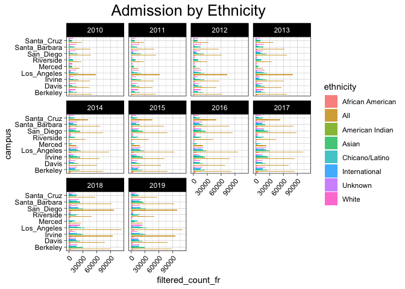
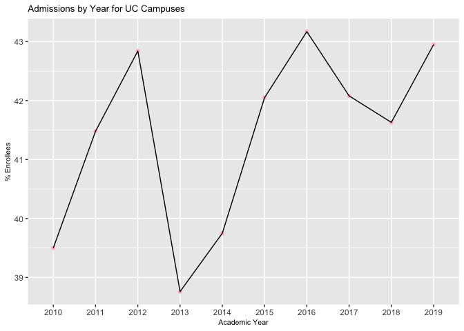

## Instructions
Answer the following questions and complete the exercises in RMarkdown. Please embed all of your code and push your final work to your repository. Your final lab report should be organized, clean, and run free from errors. Remember, you must remove the `#` for the included code chunks to run. Be sure to add your name to the author header above. For any included plots, make sure they are clearly labeled. You are free to use any plot type that you feel best communicates the results of your analysis.  

Make sure to use the formatting conventions of RMarkdown to make your report neat and clean!  

## Libraries

```r
library(tidyverse)
library(shiny)
library(shinydashboard)
library("naniar")
library("janitor")
```

## Data
The data for this assignment come from the [University of California Information Center](https://www.universityofcalifornia.edu/infocenter). Admissions data were collected for the years 2010-2019 for each UC campus. Admissions are broken down into three categories: applications, admits, and enrollees. The number of individuals in each category are presented by demographic.  

```r
UC_admit <- read_csv("data/UC_admit.csv")
```

```
## Rows: 2160 Columns: 6
## ── Column specification ────────────────────────────────────────────────────────
## Delimiter: ","
## chr (4): Campus, Category, Ethnicity, Perc FR
## dbl (2): Academic_Yr, FilteredCountFR
## 
## ℹ Use `spec()` to retrieve the full column specification for this data.
## ℹ Specify the column types or set `show_col_types = FALSE` to quiet this message.
```

```r
names(UC_admit)
```

```
## [1] "Campus"          "Academic_Yr"     "Category"        "Ethnicity"      
## [5] "Perc FR"         "FilteredCountFR"
```

```r
UC_admit <- UC_admit %>%
  mutate(`Perc FR`=as.numeric(sub("%", "", `Perc FR`))) %>% 
  clean_names()
```


```r
names(UC_admit)
```

```
## [1] "campus"            "academic_yr"       "category"         
## [4] "ethnicity"         "perc_fr"           "filtered_count_fr"
```


**1. Use the function(s) of your choice to get an idea of the overall structure of the data frame, including its dimensions, column names, variable classes, etc. As part of this, determine if there are NA's and how they are treated.**  

```r
summary(UC_admit)
```

```
##     campus           academic_yr     category          ethnicity        
##  Length:2160        Min.   :2010   Length:2160        Length:2160       
##  Class :character   1st Qu.:2012   Class :character   Class :character  
##  Mode  :character   Median :2014   Mode  :character   Mode  :character  
##                     Mean   :2014                                        
##                     3rd Qu.:2017                                        
##                     Max.   :2019                                        
##                                                                         
##     perc_fr        filtered_count_fr 
##  Min.   :  0.060   Min.   :     1.0  
##  1st Qu.:  3.015   1st Qu.:   447.5  
##  Median : 15.000   Median :  1837.0  
##  Mean   : 25.012   Mean   :  7142.6  
##  3rd Qu.: 30.325   3rd Qu.:  6899.5  
##  Max.   :100.000   Max.   :113755.0  
##  NA's   :1         NA's   :1
```


```r
miss_var_summary(UC_admit)
```

```
## # A tibble: 6 × 3
##   variable          n_miss pct_miss
##   <chr>              <int>    <dbl>
## 1 perc_fr                1   0.0463
## 2 filtered_count_fr      1   0.0463
## 3 campus                 0   0     
## 4 academic_yr            0   0     
## 5 category               0   0     
## 6 ethnicity              0   0
```

**2. The president of UC has asked you to build a shiny app that shows admissions by ethnicity across all UC campuses. Your app should allow users to explore year, campus, and admit category as interactive variables. Use shiny dashboard and try to incorporate the aesthetics you have learned in ggplot to make the app neat and clean.**  

```r
UC_admit %>%
  group_by(campus) %>%
  filter(filtered_count_fr!="NA") %>%
  mutate(academic_yr=as.factor(academic_yr)) %>%
  ggplot(aes(x=campus, y=filtered_count_fr, fill=ethnicity))+
  facet_wrap(~academic_yr)+
  geom_col(position="dodge", alpha=0.8)+
  coord_flip()+
  theme_linedraw()+
  theme(plot.title=element_text(size=rel(1.75), hjus=0.5), axis.text.x = element_text(angle=50, hjust=1))+
  labs(title="Admission by Ethnicity")
```

<!-- -->


```r
ui <- dashboardPage(
  dashboardHeader(title = "UC Campus Admissions by Ethnicity 2010-2019"),
  dashboardSidebar(disable=T),
  dashboardBody(
    fluidRow(
      box(title = "Plot Options", width = 3,
          radioButtons("x", "Select Year", choices = c("2010", "2011", "2012", "2013", "2014", "2015", "2016", "2017", "2018", "2019"), 
                       selected = "2010"),
          selectInput("y", "Select Campus", choices = c("Davis", "Irvine", "Berkeley", "Irvine", "Los_Angeles", "Merced", "Riverside", "San_Diego", "Santa_Barbara", "Santa_Cruz"),
                      selected = "Davis"),
          selectInput("z", "Select Admit Category", choices = c("Applicants", "Admits", "Enrollees"),
                      selected = "Applicants")
      ), # close the first box
      box(title = "UC Admissions", width = 8,
          plotOutput("plot", width = "600px", height = "500px")
      ) # close the second box
    ) # close the row
  ) # close the dashboard body
) # close the ui

server <- function(input, output, session) { 
  
  output$plot <- renderPlot({
    UC_admit %>% 
      filter(academic_yr==input$x & campus==input$y & category==input$z) %>% 
      ggplot(aes(x=reorder(ethnicity, filtered_count_fr), y=filtered_count_fr)) + 
      geom_col(color="black", fill="pink", alpha=0.75) +
      theme_light(base_size = 18) +
      theme(axis.text.x = element_text(angle = 50, hjust = 1))+
      labs(x = "Ethnicity", y = "Number")
  })
  
  session$onSessionEnded(stopApp)
  
}

shinyApp(ui, server) 
```

```{=html}
<div style="width: 100% ; height: 400px ; text-align: center; box-sizing: border-box; -moz-box-sizing: border-box; -webkit-box-sizing: border-box;" class="muted well">Shiny applications not supported in static R Markdown documents</div>
```


**3. Make alternate version of your app above by tracking enrollment at a campus over all of the represented years while allowing users to interact with campus, category, and ethnicity.**

```r
UC_admit %>%
  mutate(academic_yr=as.factor(academic_yr)) %>%
  filter(campus=="Berkeley") %>%
  filter(category=="Enrollees") %>%
  filter(ethnicity=="Asian") %>%
  ggplot(aes(x=academic_yr, y=perc_fr)) +
  geom_point(color="pink") +
  geom_path(group="keep") +
  labs(title="Admissions by Year for UC Campuses",
       x="Academic Year",
       y="% Enrollees") +
  theme(plot.title = element_text(size = 10),
        axis.title.x = element_text(size=8),
        axis.title.y = element_text(size=8))
```

<!-- -->


```r
ui <- dashboardPage(
  dashboardHeader(title = "UC Admissions"),
  dashboardSidebar(disable = TRUE),
  dashboardBody(
    
    fluidRow(
      
      box(title = "Plot Options", width = 3, 
          selectInput("x", "Select Campus", 
                      choices = unique(UC_admit$campus), 
                      selected = "Davis"), 
          selectInput("y", "Select Category", 
                      choices = unique(UC_admit$category), 
                      selected = "Applicants"), 
          selectInput("z", "Select Admit Ethnicity", 
                      choices = unique(UC_admit$ethnicity), 
                      selected = "International")
      ), #close the first box
      
      box(title = "Yearly Trends", width = 8,
          plotOutput("plot", width = "600px", height = "500px")
      ) #close the second box
    ) #close the row
    
  ) #close the dashboard body
) #close the ui

server <- function(input, output, session) {
  
  session$onSessionEnded(stopApp)
  output$plot <- renderPlot({
    
    UC_admit %>% mutate(academic_yr=as.factor(academic_yr)) %>% 
      filter(ethnicity != "All" & perc_fr != "NA") %>%  # filter out
      filter(campus == input$x) %>% 
      filter(category == input$y) %>% 
      filter(ethnicity == input$z) %>%
      ggplot(aes_string(x="academic_yr", y="perc_fr")) +
      geom_point() +
      geom_path(group="keep") +
      labs(x="Academic Year",
           y="Percentage of Applicants, Admits, or Enrollees") +
      theme(axis.title.x = element_text(size=8),
            axis.title.y = element_text(size=8))
    
  })
  
}

shinyApp(ui, server)
```

```{=html}
<div style="width: 100% ; height: 400px ; text-align: center; box-sizing: border-box; -moz-box-sizing: border-box; -webkit-box-sizing: border-box;" class="muted well">Shiny applications not supported in static R Markdown documents</div>
```


## Push your final code to GitHub!
Please be sure that you check the `keep md` file in the knit preferences. 
